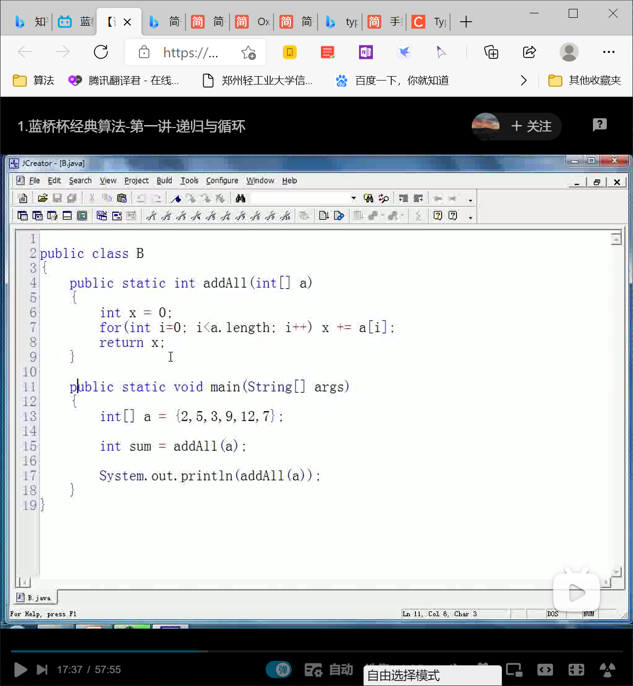

# 蓝桥杯-数据结构与算法

#### 第一讲

###### 递归与循环

1. 循环都可以递归

   1. sometimes 由于栈的限制需要“尾递归”
   2. Java不支持“尾递归”

2. 有些语言没有循环只有递归：Lisp

3. 循环改递归

   1. 关键在于发现逻辑的相似性
   2. 递归出口

   ```java
   
   //print out 0~9
   public class A{
   	public stactic void main(String[] args){
           for(int i=0; i<10; i++){
               System.out.println(i);
           }
       }
   }
   ```

   ```java
   
   //In recursion way : 相似性通过函数参数的变化体现
   // Soleve the function similarity first,and then solve the recursion exit
   public class Recursion{
   
       public static void f(int n){ //0 ~ n
          	if(n>0) f(n-1);
           System.out.println(n);
       }
   
       public static void f2(int n){ //n ~ 0
           System.out.println(n);
           if(n>0) f2(n-1);
       }
   
       public static void f3(int begin, int end){  //begin ~ end
           System.out.println(begin);
           if(begin<end) f3(begin+1,end);
       }
       public static void main(String[] args){
           f(9);
           f2(9);
           f3(2,5);
       }
   }
   
   
   ```

4. 构造相似性（多加练习）

   1. 没有明显相似性需要主动构造

   2. 不能相似的原因可能是缺少参数——添加参数

   3. 递归~~递推公式（数学）

      

      

      ```java
      
          // 求数组 a 中，从第 begin 项到最hou一项元素之和
          public static int f(int[] a, int begin){
              if(begin == a.length) 
                  return 0;
              int x = f(a,begin+1);
              return x+a[begin];
          }
          //求数组 a 中， 从第 0 项到 end 项元素之和
          public static int f1(int[] a, int tail){
              if(tail == -1) 
                  return 0;
              int x = f1(a, tail-1);
              return x+a[tail];
          }
      ```

      ```java
      
      /*
       * To judge if two strings are equal or not.
       */
      
      public class C {
          public static boolean f(String s1, String s2){
              if(s1.length() != s2.length()) return false;            //Compare the string's length
              if(s1.length() == 0) return true;                       //Compare character one by one if string not null ; btw, if s1 is null , s2 must be null
              if(s1.charAt(0) != s2.charAt(0)) return false;          //Compare the capital character
              return f(s1.substring(1), s2.substring(1));
          }
          public static void main(String[] args) {
              String a = "hfakal";
              String b = "hfakal";
              System.out.println(f(a,b));
          }
      }
      ```

      ```java
      
      // From n balls, pick m at random (do not put back), find how many ways
      // 平地起风雷 ：Suppose there is a special ball in n balls, and the partition standard is based on the package containing x or not
      public class Cnm {
      
          public static int f(int n, int m) {
              if(n<m) return 0;
              if(n==m) return 1;      // take all n of them out
              if(m==0) return 1;      // don't take any of the n balls
              
              return f(n-1,m-1) + f(n-1,m);       // the next layer is going to take either m-1 (special ball is taken out) or m (special ball is still in) out of n-1
          }
          public static void main(String[] args) {
              int k = f(10, 3);
              System.out.println(k);
          }    
      }
      
      ```

      ```java
      
      // find the full permutation of n elements
      // abc acb bac bca cab cba: the first element is stable for each substring, arrange the rest elements.
      public class ArrangeN {
      
          public static void f(char[] data, int k) {
              if(k == data.length){
                  for(int i = 0; i < data.length; i++) System.out.print(data[i] + " "); // 
                  System.out.println();
              }
      
              for(int i = k; i < data.length; i++){
                  {char t = data[k]; data[k] = data[i]; data[i] = t;} // the first element of the substring is data[i], we exchange the values of data[i] & data[k]
                  f(data, k+1);
                  {char t = data[k]; data[k] = data[i]; data[i] = t;} // 回溯 recall，Exchanging liquid in two cups twice is equal to no exchange at all
                  
              }
          }
          public static void main(String[] args) {
              char[] data = "ABCDE".toCharArray();
              
              f(data, 0);
          }
          
      }
      
      ```

      

5. 递归调用

   1. 仅仅是被调函数恰为主调函数
   2. 注意每次调用的层次不同
   3. 每次分配形参并非同一个变量
   4. 注意返回次序

